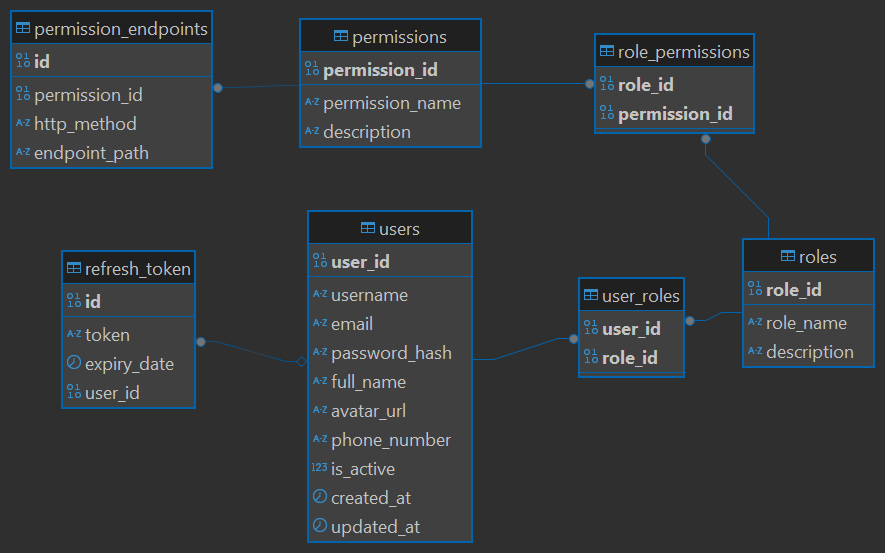

## Chức năng

🔐 1. Xác thực (Authentication)
- Đăng ký (Sign up)

- Đăng nhập (Sign in)

- Đăng xuất (Logout)

- Quản lý phiên đăng nhập (Session/token, JWT, OAuth)

- Xác thực hai bước (2FA - Two-Factor Authentication)

🧑 2. Quản lý hồ sơ người dùng (User Profile)
- Xem và cập nhật thông tin cá nhân

- Cập nhật avatar, email, số điện thoại

- Thay đổi mật khẩu

- Thiết lập cài đặt cá nhân

🛂 3. Phân quyền và vai trò (Authorization & Roles)
- Gán vai trò: admin, user, guest...

- Kiểm soát quyền truy cập tài nguyên (RBAC – Role-Based Access Control)

- Giao tiếp với các service khác để kiểm tra quyền

✉️ 4. Gửi thông báo và xác thực qua email/sms
- Gửi email xác minh tài khoản

- Gửi mã OTP (qua email, SMS)

- Gửi thông báo liên quan đến tài khoản

♻️ 5. Khôi phục / reset tài khoản
- Quên mật khẩu (Forgot Password)

- Đặt lại mật khẩu (Reset Password)

- Tạm khóa/mở khóa tài khoản

📊 6. Theo dõi và thống kê người dùng
- Đếm số lượng người dùng đang hoạt động

- Thống kê đăng nhập, lượt truy cập

- Ghi log hoạt động của người dùng (audit log)

🔌 7. Tích hợp với dịch vụ bên ngoài (nếu cần)
- Đăng nhập bằng Google, Facebook, Apple (OAuth2)

- Đồng bộ dữ liệu người dùng với hệ thống CRM, Analytics

## Diagram

